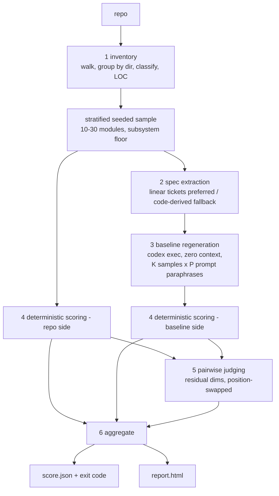

# 2bench Architecture

*Companion to [research-report.md](research-report.md), which holds the evidence for each decision. This file holds the how.*

## Pipeline



## Stage contracts (types in `src/types.ts`)

| # | Stage | In → Out | Status |
|---|---|---|---|
| 1 | `stages/inventory.ts` | repo path → `RepoInventory` (modules, LOC, subsystems) → `sampleModules()` picks the evaluation set | ✅ tested |
| 2 | `stages/spec-extract.ts` | `ModuleInfo` → `ModuleSpec` (business-level; `source: 'linear' \| 'extracted'`); external specs via `--specs` (X1) take priority; extracted specs get an identifier-leakage check | ✅ tested |
| 3 | `stages/regenerate.ts` | `ModuleSpec` → `BaselineCandidate[]` (K×P scratch dirs; structured-output `files[]`, path-traversal guarded, stdlib-only) | ✅ tested |
| 3b | `stages/testgen.ts` + `harness/run-tests.ts` | spec → shared augmented test suite (cached by spec hash) → run against BOTH sides via subject-merging child runner → `testPassRate` (D1) | ✅ tested |
| 4 | `stages/deterministic.ts` | implementation dir → `DeterministicScores` (all sub-scores normalized to [0,1], 1 = best): complexity (built-in), duplication, security, secrets, lint — capability-gated; mutation (D4) pending | ✅ tested |
| 4b | `scanners/consistency.ts` | K baseline candidates → stability ∈ [0,1] | ✅ tested (D3) |
| 5 | `stages/judge.ts` | spec + two implementations + dimension → `PairOutcome` (two swapped passes, disagreement = tie) | ✅ orchestration + reconciliation + `judgeModule` tested; context-size handling TODO |
| 5b | `stages/mapping.ts` | sub-scores + judged verdicts → 4 dimension scores + outcomes | ✅ tested |
| 6 | `stats/aggregate.ts` | outcomes + per-side dimension scores → win rate (Wilson), composite uplift (bootstrap over per-module paired uplifts), gate on CI lower bound | ✅ tested |
| — | `pipeline.ts` | orchestrates 1–6, DI engine, per-module checkpoint/resume, `--offline` | ✅ tested (fake engine) |
| — | `skill-pipeline.ts` | **skill mode**: treatment (with skill) vs control (zero-shot) arms over a bench file's tasks, K samples each, then stages 4–6 unchanged | ✅ tested |
| — | `history.ts` | append-only `history.jsonl` per run + `summarizeTrend` (records the baseline model — the moving target) | ✅ tested |
| 7 | `report/` | `RunResult` → `score.json` ✅ + `console-report.ts` ✅ + `report.html` ✅ | ✅ tested |

## Engine: `engine/codex.ts`

Headless Codex CLI driver, pattern verified on codex-cli 0.144.5:

- Prompt travels via **stdin** (`codex exec -`), and stdin is **closed** after writing — codex blocks forever on open piped stdin (found empirically).
- `--json` → JSONL events parsed for token usage; `-o` file → final message; `--output-schema` → schema-validated JSON replies (`codexExecJson<T>()`).
- `--skip-git-repo-check --ephemeral`, sandbox `read-only` (extraction/judging) or `workspace-write` (regeneration into a scratch dir).
- Reasoning effort default is **none**; judging passes `-c model_reasoning_effort=high` (non-reasoning judges are near-random on code).
- Windows: npm ships `codex` as a `.cmd` shim; Node refuses `.cmd` without a shell (CVE-2024-27980 hardening), so the driver uses `shell: true` on win32 with self-quoted args. Prompts never travel through argv.

## Non-negotiable invariants

These encode the research findings and hard-won engineering doctrine — do not "simplify" them away:

1. **Determinism of the evaluator itself**: every stochastic step (sampling, bootstrap) uses a seeded RNG (`stats/random.ts`). Same repo + same seed ⇒ identical output.
2. **Deterministic evidence outranks judged opinion**: a dimension that can be executed (tests, scanners) is never delegated to the LLM judge.
3. **Position swap is mandatory**: every judged comparison runs twice with A/B swapped; disagreement is a tie (`reconcileSwappedVerdicts`, tested).
4. **The gate uses the CI lower bound**, never the point estimate.
5. **Ties are counted** (½ win), never dropped.
6. **No naive CLT intervals** at N = 10–50; Wilson for proportions, seeded bootstrap for composites (paired-Bayesian is the planned upgrade, HANDOFF S1).
7. **Information parity for the baseline**: the vanilla LLM gets the same spec altitude the delivery pipeline got — business requirements, never a distillation of the finished code (spec-circularity threat). In skill mode this is structural: both arms get the identical task prompt and the skill text is the only difference.
8. **Distributions, not means, for static metrics** (power-law warning): e.g., `complexityHealth` = share of LOC in files whose max function complexity is below the unhealthy threshold (15), never a repo-wide average.
9. **Degrade loudly**: a missing scanner produces a `null` sub-score and a report note, never a silent 0 or a crash.

## Work directory layout (at runtime)

```
.2bench/
├── run-<timestamp>/
│   ├── specs/<module>.json
│   ├── baseline/<module>/p<prompt>-s<sample>/   ← regenerated candidates
│   ├── scores/…
│   ├── score.json
│   └── report.html
```
(`.2bench/` is gitignored.)
